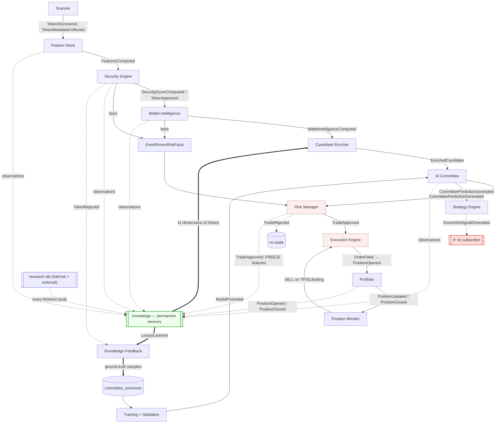
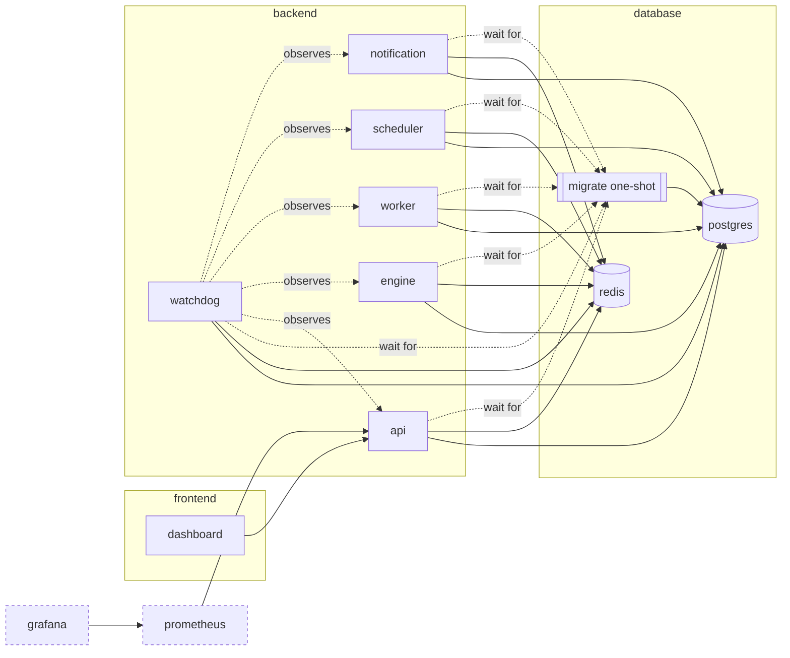
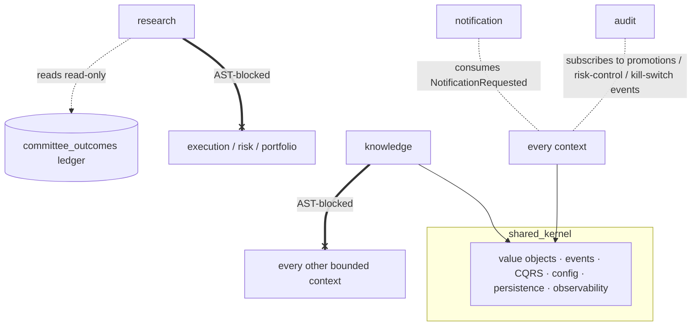

# Architecture maps

The authoritative narrative reference is [`../hades.md`](../hades.md). This document holds
the **maps** — the pipeline flow, the service topology, the context-dependency graph and the
event map — plus the Architecture Decision Records. Everything here is traced to source
(event names come from each context's `domain/events.py`).

---

## 1. Decision pipeline (data flow)

Data flows one way. The AI layer only ever produces probabilities; **only the Risk Manager
authorises a trade**, and only the Execution Engine knows paper vs. live.

> **Corrected 2026-07-28.** This diagram previously showed a `Committee → Scoring → Strategy
> → Risk` chain the code does not execute: the `scoring` context has no wiring at all, and
> the Strategy Engine runs *in parallel* with Risk rather than upstream of it. See
> [`ARCHITECTURE_AUDIT_2026-07-28.md`](ARCHITECTURE_AUDIT_2026-07-28.md) §8.
>
> **Updated 2026-07-28 (Phase 1).** The **learning loop is now closed** through the new
> `knowledge` context (green). Dashed red edges are still **breaks in the graph** — a
> producer with no consumer.
>
> **Updated 2026-07-28 (Phase 3).** The loop's **read** half is closed too: the memory feeds
> the decision path through the mandatory **Candidate Enricher**. Nothing reaches the AI
> Committee without passing through it — `CommitteeManager.evaluate` accepts only an
> `EnrichedCandidate`.

- **Quantify (blue):** Scanner → … → AI Committee. Produce evidence; never decide.
- **Decide (red):** Risk Manager (sole trade authoriser) → Execution Engine (sole
  mode-aware component).
- **Remember (green):** Knowledge. Records from every producer; joins each decision with its
  realised outcome; **cannot act** — see §3a.
- **Broken (dashed red):** the Strategy Engine's ensemble output still has no consumer.

### The learning loop (closed in Phase 1)

The thick edges above are the loop that did not exist. Its two hard rules:

1. **Features are frozen at `TradeApproved`, never read at `PositionClosed`.** Reading them
   at settlement labels the state of the world at the moment of *sale* with the result of the
   trade — temporal leakage, which yields excellent offline metrics and a model that cannot
   work. Pinned by `tests/test_knowledge_loop.py::test_the_lesson_uses_features_from_entry_not_from_exit`.
2. **A decision settles exactly once.** The bus is at-least-once; a redelivered close must
   produce nothing, not a second copy of the lesson silently doubling that trade's weight in
   every future dataset. Enforced by the journal's take-once semantics *and* a unique
   constraint on `knowledge_lessons.ref`.

`ModelPromoted` now closes the deployment half too: the committee reloads its active models
in place, where previously a promotion changed nothing until the worker was restarted.

### The enrichment stage (added in Phase 3)

Between the Decision Context Builder and the committee, every candidate is enriched from
permanent memory along eleven dimensions — developer, wallets, clusters, narrative, launchpad,
liquidity, volatility, the token's own outcomes, similar strategies, holder structure and the
nearest past patterns. Three properties make it safe to have on the hot path of a firehose:

1. **It cannot be bypassed.** The type of `evaluate` is the enforcement; there is no overload
   taking a bare `DecisionContext`.
2. **It cannot relax the platform.** With an empty memory the fused prior is exactly `0.0`,
   so the probabilities are bit-for-bit what they were before the stage existed. The prior is
   shrunk toward ignorance, silent below a minimum cohort size, and bounded overall.
3. **It cannot block.** An unreachable memory yields a neutral, explicitly-labelled "could not
   ask" enrichment and the token is still judged — and that state is distinguishable in the
   metrics from a memory that was asked and had nothing.

The dependency is a **narrow read port the Learning context declares itself**
(`CandidateHistoryPort`), satisfied by one adapter at Learning's edge that touches only
Knowledge's *domain* layer. Knowledge still imports nothing; the arrow points Learning →
Knowledge, so no cycle exists.

### Contexts with no wiring

`contexts/scoring` and `contexts/wallet` exist as domain packages with **zero references from
anywhere else in the codebase**. `FinalScoreComputed` and `WalletScoreComputed` are never
published. They are listed in §4's event map for completeness, marked accordingly.

## 2. Service topology (Docker Compose)

Three network tiers isolate the presentation, application and data layers. Data-store
ports are unpublished in production; observability admin UIs bind to localhost.

Startup order: `postgres`/`redis` healthy → `migrate` runs `alembic upgrade head` and exits
→ every app service starts (gated on `migrate` completing) → `dashboard` after `api`.

**Where the contexts run:** the Scanner, AI Committee, Strategy, Research, Audit and
Performance runtimes live in the **worker**; the decision loop in the **engine**; REST/WS in
the **api**; Discord delivery in **notification**; periodic jobs (backups, cleanup) in
**scheduler**; liveness/health/recovery in **watchdog**.

## 3. Context dependency & isolation map

Contexts never import each other's internals — they communicate through domain events on
the bus. Three isolation rules are **structurally enforced by tests**:

- **Research Lab isolation (verified):** `tests/test_research_isolation.py` AST-parses every
  file under `contexts/research` and fails the build if it imports `execution`, `risk` or
  `portfolio`; it also asserts promotion payloads carry no order/size and require
  `manual_approved`.
- **Knowledge isolation (verified, stricter):** `tests/test_knowledge_isolation.py` asserts
  `contexts/knowledge` imports **no other bounded context at all** — an allowlist rather than
  a blocklist, so a context added next year is covered without anyone remembering to add it.
  It also checks that `ops/knowledge_runtime` does not reintroduce the coupling, and that
  every event name that runtime subscribes to still resolves to a real event class.

  Knowledge is wired into every producer on the platform; that is only safe because it cannot
  act. It has no concept of an order, a position or a trading mode, and it hears about the
  world through one self-owned inbound type (`KnowledgeEnvelope`) that the composition root
  translates into. There is nothing to import, so there is no import to abuse.

  The event-name check found a real pre-existing defect on its first run: `OrderSubmitted` /
  `OrderFilled` / `OrderFailed` had never been registered in `bootstrap._build_registry`, so
  under the Redis transport they were silently discarded at every process boundary.
- **Research ↔ Knowledge decoupling (verified, both directions):** Research is the platform's
  official knowledge producer, and the connection is nothing but domain events. Neither
  context imports the other. A direct call would put an ingestion failure on the lab's
  critical path and hand a context that must never act a live handle on one that writes.
- **Enrichment is mandatory (verified):** `tests/test_committee_enrichment.py` asserts the
  committee refuses a bare decision context and that the handler cannot be constructed without
  an enricher — so "no candidate is judged from scratch" is a property of the types, not of
  anyone's discipline. The same file pins the other half: with an empty memory the enrichment
  is *exactly* neutral, so the stage can never act as a hidden recalibration.
- **Single trade authoriser (verified):** `TradeApproved` is constructed in exactly one
  place — `risk/application/manager.py`.
- **No two events share a routing key (verified):** the bus routes on the class name, so two
  contexts may not define an event with the same one. `contexts/research` and
  `contexts/strategy` both defined `StrategyPromoted`; they collided on one key and the
  registry silently kept whichever was registered last, so under Redis a lab promotion was
  rebuilt as a strategy-engine promotion and audited as one. Now scanned across every
  `domain/events.py` by `test_events_registry`.

## 4. Event map

Every context owns its events (`contexts/<name>/domain/events.py`). The bus is an
`EventBus` port with an in-memory transport (single process) and a Redis Streams transport
(per-service consumer groups; every service sees every event; at-least-once, so handlers are
idempotent).

| Context | Key published events | Primary consumers |
|---|---|---|
| **scanner** | `TokenDiscovered`, `PoolDiscovered`, `TokenMetadataCollected`, `SignificantChangeDetected`, `RpcEndpointSwitched`, `SourceHealthChanged`, `DataQualityAnomalyDetected` | Feature Store, Security Engine, Watchdog |
| **security** | `SecurityScoreComputed`, `TokenApproved`, `TokenRejected`, `ContractRiskDetected`, `LiquidityWarning`, `ClusterFound`, `DeveloperRisk` | Wallet Intelligence, AI Committee, Audit |
| **intelligence** (wallet KB) | `WalletProfileComputed`, `WalletIntelligenceComputed`, `SmartMoneyDetected`, `ReputationUpdated`, `ClusterCreated`, `FundingRelationshipFound`, … | AI Committee |
| **wallet** ⚠️ | `WalletScoreComputed` — **never published; the context has no wiring** | *(none)* |
| **learning** (AI Committee) | `CommitteePredictionGenerated`, `InferenceCompleted`, `ConfidenceCalculated`, `ModelTrained`/`Validated`/`Promoted`/`Rejected`, `ModelDriftDetected` | Scoring, Strategy, Audit, Monitoring |
| **scoring** ⚠️ | `FinalScoreComputed` — **never published; the context has no wiring** | *(none)* |
| **strategy** | `EnsembleSignalGenerated` ⚠️ **(no subscriber)**, `SignalGenerated`/`Rejected`, `StrategyLoaded`/`Disabled`/`Error`, `ShadowActivated`, `StrategyPromoted`, `WeightUpdated` | Audit only |
| **risk** | `TradeApproved`, `TradeRejected`, `RiskReduced`, `KillSwitch*`, `CircuitBreaker*`, `EmergencyMode*`, `Drawdown/ExposureLimitBreached`, `RiskControlCommandIssued` | Execution, Portfolio, Audit, Notification |
| **execution** | `OrderSubmitted`, `OrderFilled`, `OrderFailed`, `TradingModeChanged` | Portfolio, Notification, Audit |
| **portfolio** | `PositionOpened`, `PositionUpdated`, `TrailingStopAdjusted`, `PositionClosed`, `CapitalCommitted`/`Released`, `PortfolioUpdated` | Risk Manager, Monitoring, Notification |
| **knowledge** | `KnowledgeRecorded`, `KnowledgeRejected`, `DecisionRecorded`, **`LessonLearned`** | AI Committee (`LessonLearned` → `committee_outcomes`) |
| **research** ⚠️ renamed | `ExperimentStarted/Finished`, `BacktestCompleted`, `WalkForwardCompleted`, `MonteCarloCompleted`, `ReplayCompleted`, `ShadowStrategyUpdated`, `ModelCompared`, `StrategyCompared`, `FeatureProposed`, `CandidateProposed`, **`ResearchStrategyPromoted`** (was `StrategyPromoted` — it collided with the Strategy Engine's event of the same name), `PromotionRejected`, `ResearchReportGenerated` | **Knowledge** (all of them), Audit |
| **notification** | `NotificationRequested` (consumed only by the Notification Service) | Notification Service → Discord |

Cross-cutting consumers: **Audit** records promotions, weight changes, kill-switch /
circuit-breaker / emergency transitions and risk-control commands generically from the event
envelope; **Monitoring/Performance** derives throughput/latency entirely from existing events
(no hot-path intrusion); the **Watchdog** reacts to health/source events and can escalate to
Emergency Mode.

---

## 5. Architecture Decision Records (ADRs)

ADRs are numbered `NNNN-title.md` here as decisions are formalised. The Phase 1/2 baseline is
documented in `hades.md` (§6/§6a).

Realised decisions (candidates to formalise retroactively):

- **Postgres schema baseline** — 57 tables across 7 migrations from `Base.metadata`
  (`alembic/versions/0001_initial_schema.py` onward); UUIDv7 pks + timestamps everywhere.
- **Redis Streams event bus** with **per-service consumer groups** (every service sees every
  event) and an `EventRegistry` for cross-boundary rebuild.
- **Background-service liveness** via heartbeat files + Docker healthchecks (`--role`), the
  watchdog verifying freshness and driving bounded auto-recovery.
- **Paper↔live switch** — DB authority (`system_configuration`) ANDed with the hard env
  gate; audited, event-driven, notification-announced; a switch to LIVE additionally
  requires an authenticated operator.
- **Turnkey deployment** — a one-shot `migrate` service gates all app services, so
  `docker compose up -d` applies the schema with no manual step.

Candidate ADRs for Hades v2 / pre-LIVE (see `PRODUCTION_READINESS.md`):

- Postgres-backed event store + `UnitOfWork` (replace the in-memory fallback) — **H1**.
- Durable execution ledger (order/transaction stores) + persisted open positions — **H2/H3**.
- WebSocket authentication contract (server + dashboard) — **H5**.
- Model registry format and promotion protocol (already implemented; formalise as an ADR).
